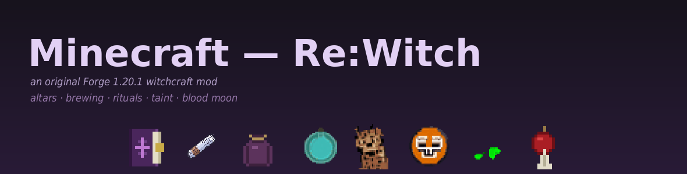
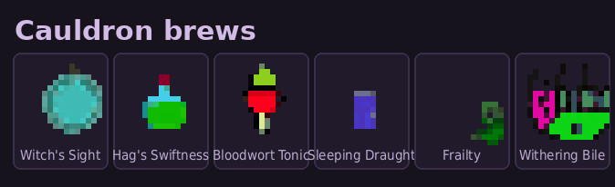
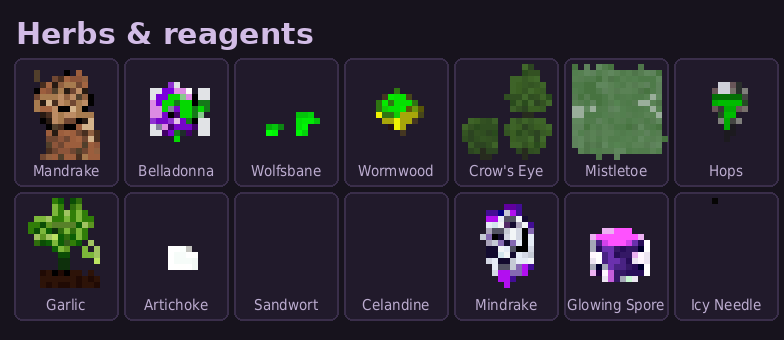
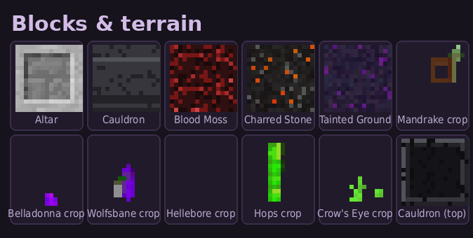

# Minecraft — Re:Witch



An original **witchcraft mod for Minecraft 1.20.1 (Forge)**. Build an altar, grow a witch-garden, brew
in the cauldron, lay ritual circles, bind combat charms — and watch the land sicken with *taint* and the
sky bleed under a *Blood Moon*. The mod ships with an in-game Patchouli guidebook (the **Grimoire**) and
this repository also bundles a self-contained dockerised test server.

> Mod id `hexerei` · Forge **47.4.10** · Minecraft **1.20.1** · Java **17**

---

## Features

- **The Altar** — a 2×3 multiblock that forms automatically on placement and draws *power* from the living
  nature around it. Power fuels brewing and rituals. Place an **artefact** on the core to bend the rules: a
  *purifier* cuts the taint your rituals leave, an *amplifier* boosts their effect but multiplies the taint.
- **The Garden** — 14+ witch herbs as staged crops (belladonna, mandrake, wolfsbane, hellebore, hops,
  crow's eye, sandwort, mistletoe …) plus mushrooms (glowing zevanty, puffball, webcap) and blood moss.
- **The Witch's Cauldron** — fill with water, light a fire beneath it, drop in herbs: it boils, bubbles and
  tints to the brewing color. Collect a **brew** with a glass bottle. Six brews, each with its own bottle art.
- **Rituals** — draw a **Ritual Sigil** and a ring of connecting **Rune** chalk-marks, drop a sacrifice, and
  perform a **rite**: Tempest, Verdant Growth, Manifestation, Bound Beast, Waning Moon, and the **Eclipse**.
- **Combat Charms** — a Charm Pouch holds Ward / Bloodlust / Hexbane charms that draw a charge from a nearby
  altar and grant passive combat buffs while carried.
- **Taint** — powerful magic dirties the land. Taint accrues per chunk, mutates terrain, and **punishes**
  players who let it fester (Hunger → Weakness → Wither). Breaking a bound ritual circle stains the ground.
- **Lunar Phases & the Blood Moon** — rites are stronger and cleaner on a full moon, weaker and dirtier on a
  new moon (read the chalk's tooltip). Rarely — or via the **Eclipse Rite** — a **Blood Moon** rises: the sky
  turns red, rituals are amplified, the land sickens faster, and hostiles are emboldened until dawn.
- **The Grimoire** — an in-game [Patchouli](https://www.curseforge.com/minecraft/mc-mods/patchouli) guidebook
  documenting every system, fully localized in English and Russian.

Everything is server-authoritative, fully localized (`en_us` + `ru_ru`), and covered by JUnit unit tests
(pure logic) and Forge GameTests (in-world behaviour).

---

## Gallery

*All art below is in-mod: 16×16 textures shown upscaled. No third-party assets.*

**Magic items & charms**


**Cauldron brews**



**Herbs & reagents**



**Blocks & terrain**



---

## Download & install

Grab the latest `hexerei-1.20.1-*.jar` from the **[Releases](https://github.com/vel5id/Minecraft-Re-Witch/releases)**
page, then drop it into the `mods/` folder of a Forge **1.20.1 (47.4.10)** install alongside
**[Patchouli](https://www.curseforge.com/minecraft/mc-mods/patchouli)** (required for the in-game guidebook).

## Building from source

Requires **JDK 17**. From the `hexerei/` directory:

```bash
cd hexerei
export JAVA_HOME=/path/to/jdk17
./gradlew --no-daemon build       # -> build/libs/hexerei-1.20.1-0.1.0.jar
./gradlew --no-daemon test        # pure unit tests
```

Drop the resulting jar into a Forge **1.20.1 (47.4.10)** `mods/` folder. **Patchouli** (1.20.1) is required for
the in-game guidebook.

## Dockerised test server

The repository root also ships a small Forge 1.20.1 server harness (`Dockerfile` + `docker-compose.yml`)
used during development. Drop your own `.jar`s into a local `mods/` folder (it is **gitignored** — no
third-party mods are redistributed here), then:

```bash
cp .env.example .env
docker compose up -d --build
docker compose logs -f minecraft   # watch for "Done ("
```

See `CLAUDE.md` for project conventions.

---

## License

Licensed under **[Creative Commons Attribution 4.0 International (CC BY 4.0)](https://creativecommons.org/licenses/by/4.0/)** —
see [`LICENSE`](./LICENSE). You may share and adapt the work for any purpose, including commercially, as long as
you give appropriate credit.

*Original mod. Not affiliated with Mojang or Microsoft.*
